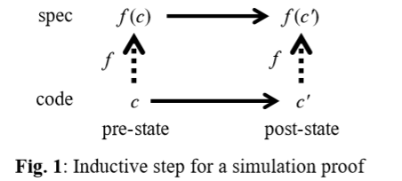

### 2.3

> 聪明的软件公司知道可靠的软件并不划算。 …发布含有一定量bug的软件并修复5％到10％的错误要便宜得多……人们抱怨。 —布鲁斯·施耐尔[^Q70]
>
> 对于简单的机制，描述它们的工作原理通常比描述它们的工作更容易，而对于更复杂的机制，通常相反。 -约翰·冯·诺伊曼[^Q86]
>
> 每个人都知道调试的难度是编写程序的两倍。 因此，如果您在编写时尽可能聪明，你怎么会需要调试？ -布莱恩·克尼根[^Q43]
>
> 测试可以显示错误的存在，但不能显示错误的不存在。 —爱德格·迪克斯特拉（Edsger Dijkstra）[^Q22]
>
> 当心上面代码中的错误； 我只是证明它是正确的，没有尝试过。 -唐纳德·努斯[^Q44]

本文大部分内容是关于如何编写代码的。 但是代码正确吗？ 换句话说，它满足规格吗？ （您没有规格？然后这个问题就没有意义了。）从理论上讲，这个问题的答案是“是”或“否”。如果

- 规范（spec）是一个谓词，它指定系统的每个允许的操作（步骤），
- 该代码精确地指定了系统执行的每个动作，并且
- 您知道客户端可以看到声明的哪些部分，

那么正确性就是一个定理：“每个可见的代码行为都是规范行为”，无论是对还是错。 本节说明如何证明该定理。 即使很少值得完成此证明，也可以通过写下下面的步骤（3）中描述的抽象函数和不变量来查找错误并深入了解代码为何起作用。

如果该定理是正确的，那么一个令人惊讶的事实是它具有模拟证明：从代码声明到规范声明有一个抽象函数𝑓，该抽象函数将每个代码动作与具有相同可见效果的规范动作匹配：$ c→𝑐'$从可达声明𝑐具有匹配的规范动作$𝑓（𝑐）→𝑓（𝑐'）$（如果动作未更改任何可见状态，则声明识）。

该图是证明每个可见代码行为都是规范行为的证明中的归纳步骤。

例如，为了模拟文件系统规范动作$𝑤𝑟𝑖𝑡𝑒（𝑛𝑜𝑑𝑒，𝑖，𝑏）$（忽略崩溃的复杂性），代码可以

- 规范中模拟NOP的一系列内部动作，将文件的字节index的索引块和数据块引入RAM，并在必要时分配新的块，
- 然后执行可见操作以将字节更新为模拟𝑤𝑟𝑖𝑡𝑒动作的，
- 然后执行更多内部代码操作，将更改的块写回到磁盘。

您可能需要在代码中添加*历史*记录变量以编写抽象方法（或者，定义一个*抽象关系*）。 这些变量可以跟踪不需要代码的规范声明； 不允许它们影响原始代码声明。 例如，简单统计系统的规范可能允许您一次添加一个数据点，然后获得整个集合的均值。 该代码递增计算平均值，并且不存储集合，因此您需要将其添加为历史记录变量。 一些规范也需要*预言变量*[^R1]，但您不太可能会遇到这种情况； 我只知道三个现实的例子。

遵循此脚本，一旦有了规格（上面的步骤（1）和（2））以及代码声明和操作，就可以通过两个步骤来连接它们：

（3）查找从代码到规范声明的抽象函数。 您将需要一些代码声明，但是其中很多声明都是为了提高性能，并且不会显示在抽象函数中。

同时，找到代码状态的*不变量*，即定义代码可以达到的状态； 证据只需要处理来自可达状态的动作。 例如，具有排序数组的代码具有这样的不变量，您需要使用它来证明使用二进制搜索在数组中查找键的代码操作确实有效。

（4）最后，做一个实际的仿真证明，证明每个代码动作都保留了可见的行为和不变量。

步骤（4）是唯一需要对*每个*可到达的代码声明中的代码中的*每个*动作进行推理的步骤，因此这是目前为止最多的工作。 步骤（3）需要*理解*代码为何起作用，并且通常会发现许多错误。 不幸的是，确保正确完成操作的唯一方法是执行步骤（4），这通常不值得。 但是编写规范总是值得的，因为它使客户端与代码解耦。 使用现代的证明系统，可以对具有数千行代码的系统进行机器检查的仿真证明，并且在更改代码后可以相当轻松地重做证明.[^R39]但这仍然是很多工作，只有在正确性十分重要时才能受益。

另一种方法是*模型检查*：系统地探索代码声明空间的一个子集，寻找违反规范的行为。 这不能保证正确性（除非行为很少，以使检查程序可以尝试所有行为），但是它会发现许多错误。 实际上，许多人的经验是，它可以找到大多数错误。[^R66]，[^R30]而且它的工作量少于仿真证明，因为检查本身是自动的，并且仅花费CPU时间。 但是，通常您必须修改代码，以诱使模型检查器探索状态空间的正确部分。

将大型系统分解为具有简单抽象状态的指定[模块]()时，测试，模型检查和证明都变得更加容易，因为您一次只需要考虑一个模块的代码状态，该状态比代码小得多。 整个系统的状态。

您可能还担心[规格是否正确]()。

#### 2.3.1 类型

类型是机器可以理解和检查的程序事实的一种方式，特别是一些程式化的前提条件和后置条件。 这个想法是

- 𝑇类型的值v具有一个额外的类型字段，其值是𝑇，
- 例程的参数必须具有预期的类型（前提条件）：如果𝑅期望类型为𝑇'，则𝑅（𝑣）是错误的，除非𝑣.type=𝑇'（或更普遍地，𝑣.type是𝑇'的[子类型]()），
- 事务的结果具有预期的类型（后置条件）。

对于动态类型，类型字段在运行时存在（通常称为类），调用会检查前提条件。 在静态系统类型中，运行时不存在“ ghost”字段，因为编译器知道每个表达式的类型，并保证如果𝑒具有类型𝑒，则𝑒.type=𝑇。 换句话说，规范（类型声明）说𝑒的值具有type类型，编译器对此进行了证明。 因此，编译器还可以检查前提条件。

为什么静态类型好？ 出于同样的原因，一般来说，进行静态检查也很不错：编译器可以尝试证明有关程序的定理，如果失败，则可以在较便宜的情况下及早发现错误。 大多数定理不是很有趣，因为它们只是说参数具有正确的类型。 有时，类型系统也可以找出（推断）类型，例如在Haskell或TypeScript中。 但是程序的初稿几乎总是有很多错误，最明显的是，所以类型检查无法证明其琐碎的定理时，它会迅速发现很多错误。

该类型带有一个表，该表是对那种类型的数据进行操作的[方法]()和例程。 静态地，编译器知道类型并查找方法。 动态地在运行时查找。 所有语言都使用这些方案中的一种，并且至少对于诸如赋值或加号之类的内置方法，它们都是静态地执行的。

#### 2.3.2 编译语言

您应该使用哪种编程语言？ 这个问题尚无统一答案，但需要考虑以下几点：

- 编写程序有多难，以使语言保证其具有*防弹*抽象状态，其中变量始终具有预期的类型，只有显式写入才能更改其值？ 通常，这意味着强类型化和垃圾回收。 从这个意义上讲，Java是*防弹*的，而C ++不是，而JavaScript在两者之间。 破坏这种抽象将使调试更加困难。
- 语言是否与您的问题领域完全匹配？ 您经常说的话容易吗？ 是否可以说出您需要说的所有话？
- 编译器会执行哪些静态检查？ 编译时发现的错误更容易修复。
- 使程序足够有效或衡量其使用资源的难度有多大？

---

[^Q70]: 
[^Q86]: 
[^Q43]: 
[^Q22]: 
[^Q44]: 
[^R1]: 
[^R39]: 

